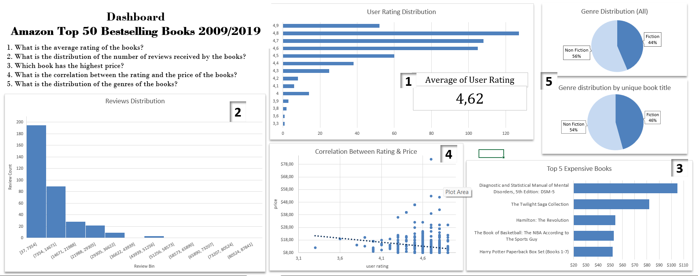
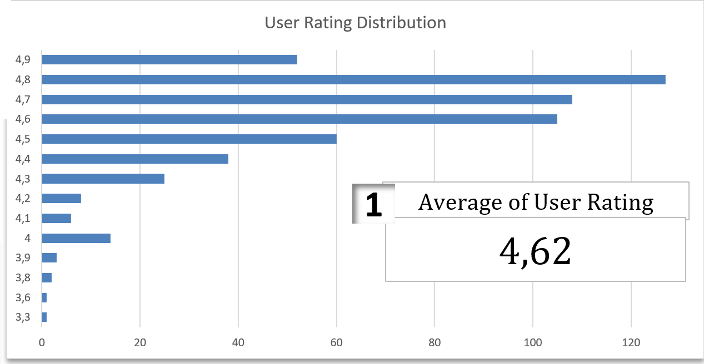
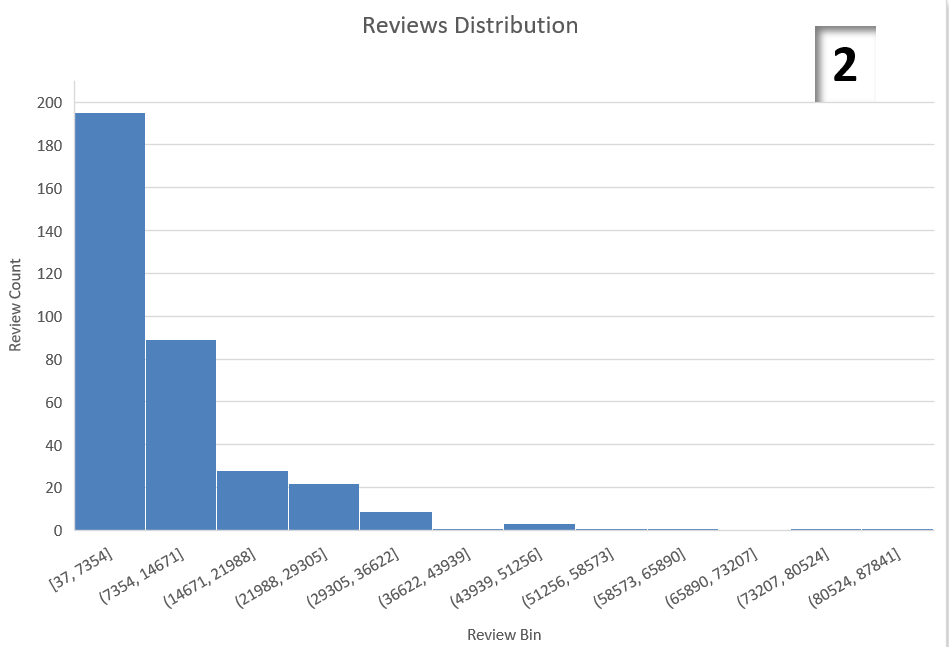
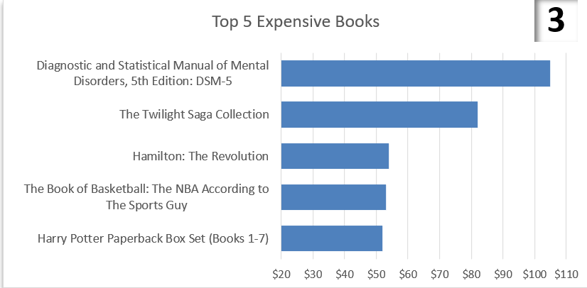
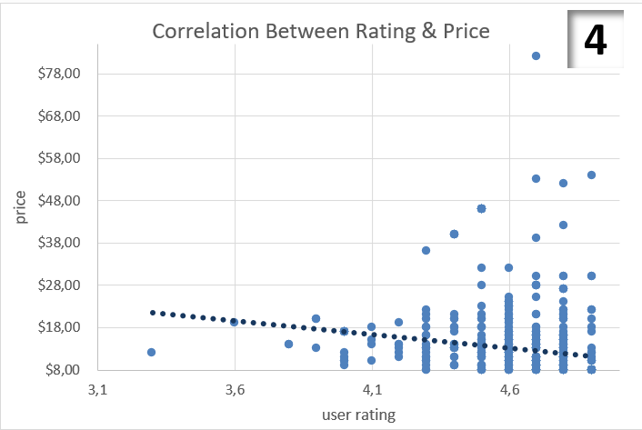
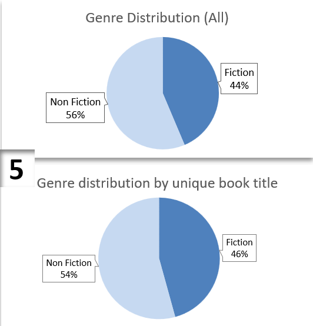

# Amazon Top 50 Bestselling Books 2009 - 2019

Dataset berupa koleksi data Top 50 Buku Terlaris Pertahun periode 2009-2019 di Amazon

### Variabel:

- Name (Judul)
- Author (Penulis)
- User Rating (Rating Pembaca)
- Reviews (Jumlah Pembaca)
- Price (Harga)
- Year (Tahun Publish)
- Genre

### Pertanyaan

1. What is the average rating of the books?
2. What is the distribution of the number of reviews received by the books?
3. Which book has the highest price?
4. What is the correlation between the rating and the price of the books?
5. What is the distribution of the genres of the books?

## Dashboard

1. 
2. 
3. 
4. 
5. 
