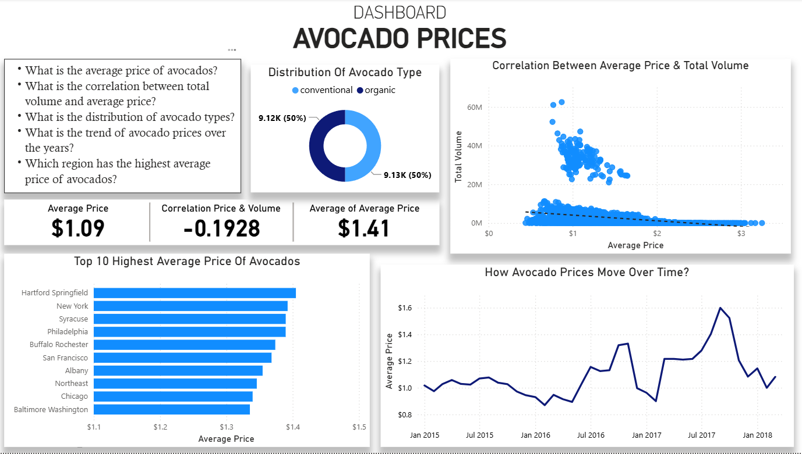
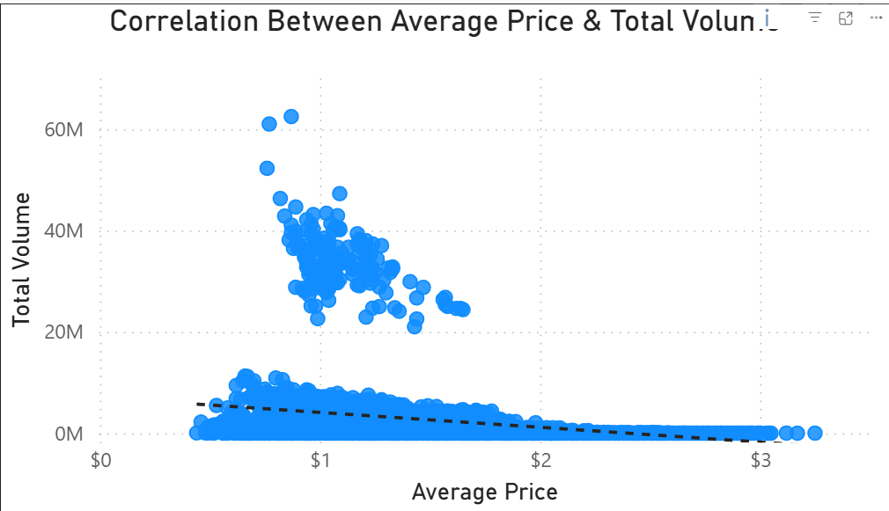
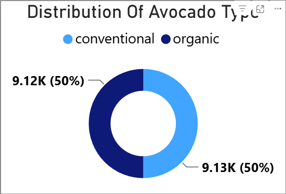
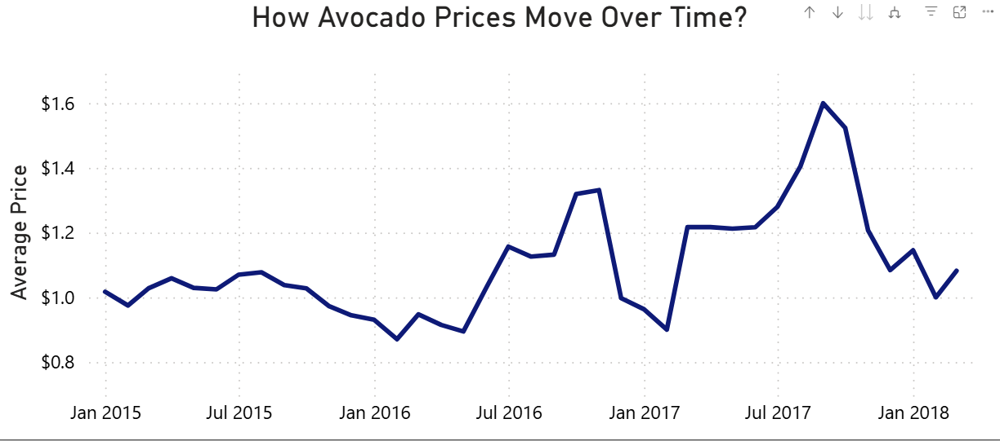
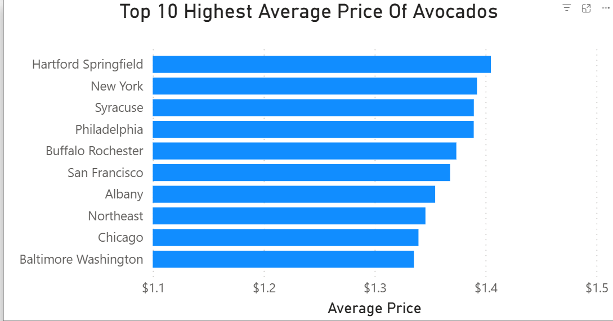

# Avocado Price

Dataset berupa koleksi data harga Alpukat di USA yang didapatkan dari sumber Hass Avocado Board dan UniteD State Department of Agriculture (USDA)

### Variabel:

- Date (Tanggal Observasi)
- AveragePrice (Harga rata-rata perbuah alpukat)
- Total Volume (Total angka alpukat terjual)

* Kode Jenis/Ukuran Alpukat (PLU)
  - 4046 (Total alpukat ukuran kecil)
  - 4225 (Total alpukat ukuran besar)
  - 4770 (Total alpukat ukuran extra besar)
* Berdasarkan Ukuran Kantong (bukan PLU)
  - Total Bags (Total kantong alpukat yang terjual)
  - Small Bags (Total kantong kecil terjual)
  - Large Bags (Total kantong besar terjual)
  - XLarge Bags (Total kantong ekstra besar terjual)

- type : Conventional atau Organic
- year (Tahun Observasi)
- region (Daerah observasi)

### Pertanyaan

1. What is the average price of avocados?
2. What is the correlation between total volume and average price?
3. What is the distribution of avocado types?
4. What is the trend of avocado prices over the years?
5. Which region has the highest average price of avocados?

## Dashboard

1. 
2. 
3. 
4. 
5. 
