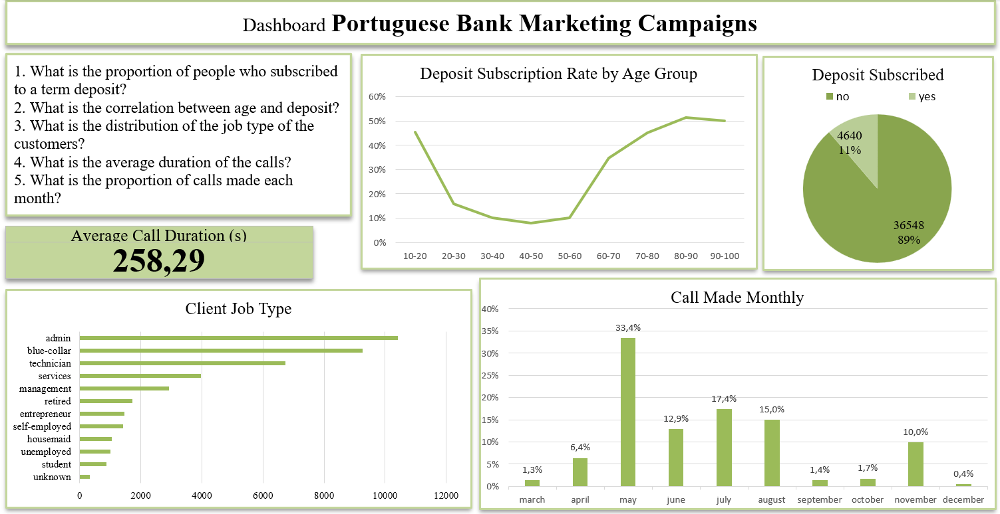
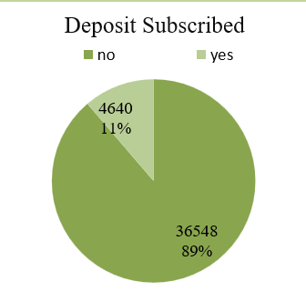
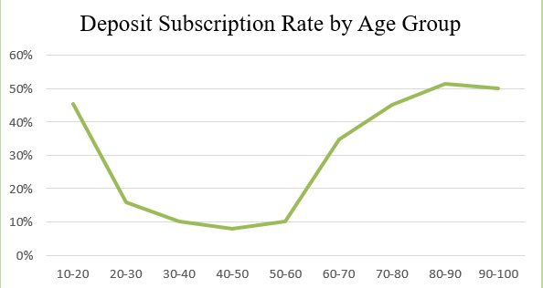
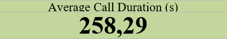
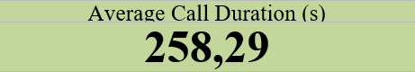
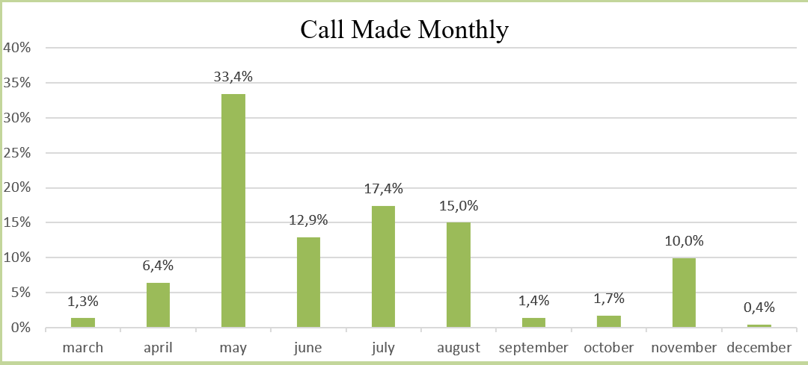

# Bank Marketing

Dataset ini berisi informasi mengenai kampanye pemasaran sebuah bank asal portugal serta data demografi nasabah dan indikator ekonomi.

### Variabel:

- age
- job : service, blue-collar, admin, etc
- marital (status pernikahan) : married, single,divorced, unknown.
- education : basic.9y, high school, university degree, etc
- default (Punya Kredit) : no, yes, unknown
- housing (Kredit Pinjaman Rumah) : no, yes, unknown
- loan (pinjaman pribadi) : no, yes, unknown
- Informasi saat dihubungi
  - contact (via) : telephone atau cellular
  - month
  - day_of_week (nama hari)
  - duration (durasi dalam detik)
- campaign (berapa kali dihubungi untuk kampanye saat ini)
- pdays (jangka hari setelah dikontak untuk kampanye sebelumnya)
- previous (berapa kali di hubungi untuk kampanye sebelumnya)
- poutcome (apakah membuka deposito berjangka setelah kampanye sebelumnya) : nonexistent, failure, success
- emp.var.rate (indikator perubahan kondisi ketenagakerjaan)
- cons.price.idx (indeks harga konsumen/inflasi)
- cons.conf.idx (tingkat kepercayaan konsumen terhadap ekonomi)
- euribor3m (tingkat suku bunga pasar uang eropa tenor 3 bulan)
- nr.employed (jumlah orang yang bekerja dalam perekonomian secara kuartalan)
- y (Membuka deposito berjangka) : no atau yes

### Pertanyaan

1. What is the proportion of people who subscribed to a term deposit?
2. What is the correlation between age and deposit?
3. What is the distribution of the job type of the customers?
4. What is the average duration of the calls?
5. What is the proportion of calls made each month?

## Dashboard

1. 
2. 
3. 
4. 
5. 
