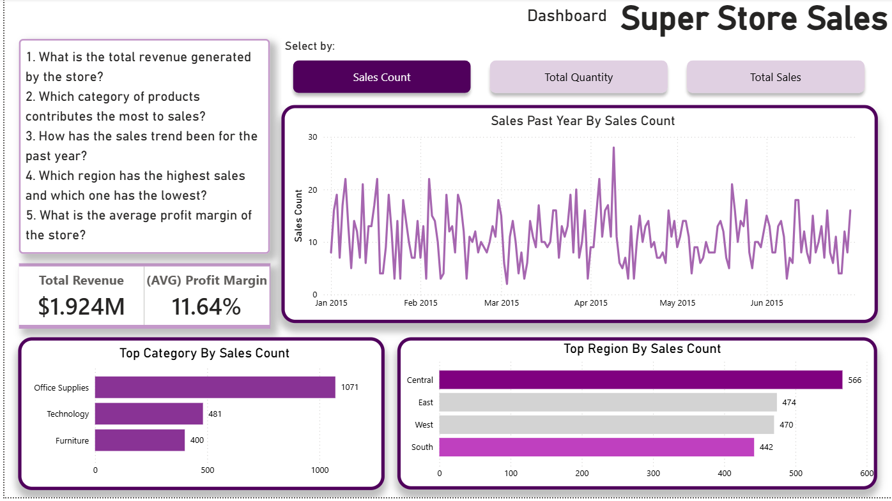
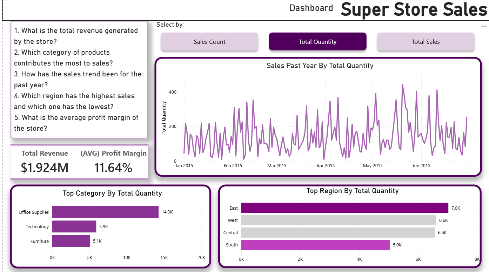
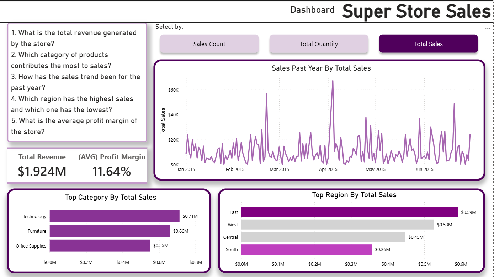

# Superstore Sales

Dataset berupa data perusahaan retail diksi yang mencakup informasi produk, pemesanan, dan pembeli.

### Variabel:

- Row ID (ID Record)
- Order Priority (Tingkat Penting Order) : low, high, critical, etc.
- Discount
- Unit Price
- Shipping Cost (Ongkos Kirim)
- Customer ID (ID unik kostumer)
- Customer Name
- Ship Mode (Kategori pengiriman) : standard air, same-day, etc
- Customer Segment (Kategori Pelanggan) : Consumer, Corporate, Small Business, etc.
- Product Category (Kategori Produk) : Furniture, Technology, etc.
- Product Sub-Category (Sub-kategori Produk) : Rubber bands, Pens & Art Supplies, Tables, etc.
- Product Container (Jenis Pembungkus) : Wrap bag, Small Box, Jumbo Drum, etc.
- Product Name
- Product Base Margin (Margin berbasis produk)
- Lokasi Transaksi
  - Country
  - Region
  - State or Province
  - City
  - Postal Code
- Order Date (Tanggal Pemesanan)
- Ship Date (Tanggal pengiriman)
- Profit (Keuntungan): Sales - Total Biaya
- Quantity ordered new (Kuantitas Pemesanan)
- Sales (Pendapatan Penjualan) : Harga Jual setelah Diskon
- Order ID (ID Transaksi)

### Pertanyaan

1. What is the total revenue generated by the store?
2. Which category of products contributes the most to sales?
3. How has the sales trend been for the past year?
4. Which region has the highest sales and which one has the lowest?
5. What is the average profit margin of the store?

## Dashboard

### Berdasarkan Jumlah Transaksi Penjualan

### Berdasarkan Total Barang Terjual

### Berdasarkan Total Pendapatan/Penjualan

