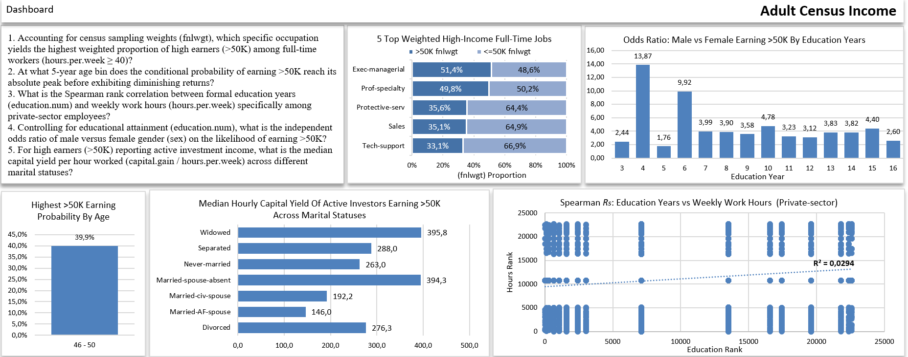
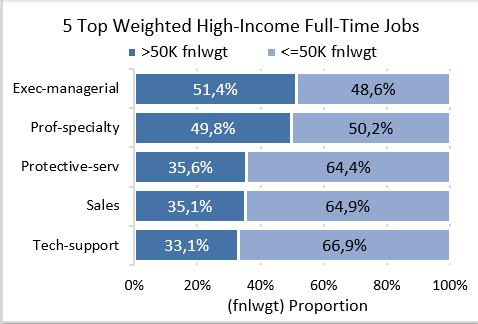
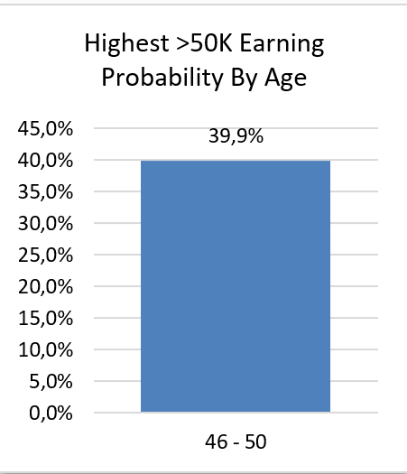
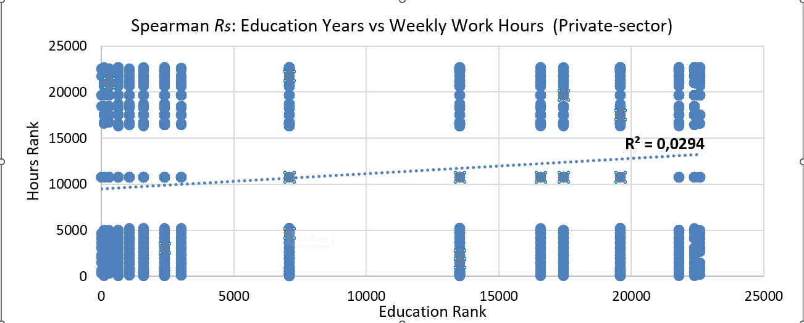
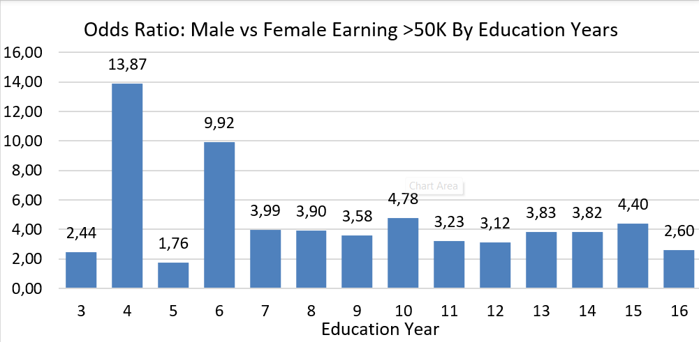
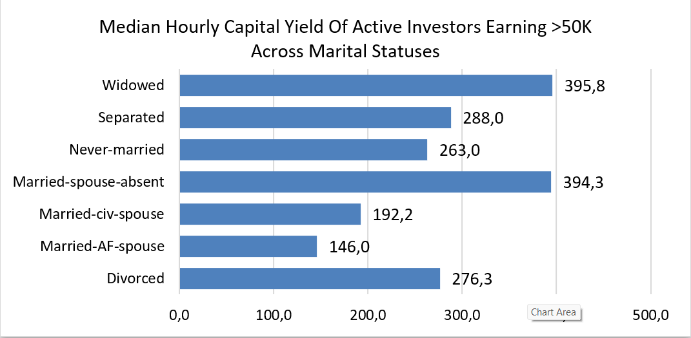

# Adult Census Income

Dataset berupa sensus penduduk USA pada tahun 1994 yang mencakup informasi kondisi ekonomi dan sosial.

### Variabel:

- age (Umur)
- workclass (Kelas pekerja) : private, state-gov,federal-gov, etc
- fnlwgt (Final weight) :
- education (Pendidikan) :
  HS-grad, Doctorate, Masters, etc
- education.num (Lama Pendidikan)
- marital.status (Status Pernikahan) : Widowed Divorced, Never-Married, etc
- occupation (Pekerjaan)
- relationship (Hubungan) : Unmarried, Own-Child, Husband, etc
- race (Suku)
- sex (Jenis Kelamin)
- capital.gain (Keuntungan dari Asset)
- capital.loss (Kerugian dari Asset)
- hours.per.week (Jam Kerja Per Minggu)
- native.country (Asal Negara)
- income (Penghasilan) : >50k atau <=50k

### Pertanyaan

1. Accounting for census sampling weights (fnlwgt), which specific occupation yields the highest weighted proportion of high earners (>50K) among full-time workers (hours.per.week ≥ 40)?
2. At what 5-year age bin does the conditional probability of earning >50K reach its absolute peak before exhibiting diminishing returns?
3. What is the Spearman rank correlation between formal education years (education.num) and weekly work hours (hours.per.week) specifically among private-sector employees?
4. Controlling for educational attainment (education.num), what is the independent odds ratio of male versus female gender (sex) on the likelihood of earning >50K?
5. For high earners (>50K) reporting active investment income, what is the median capital yield per hour worked (capital.gain / hours.per.week) across different marital statuses?

## Dashboard

1. 
2. 
3. 
4. 
5. 
