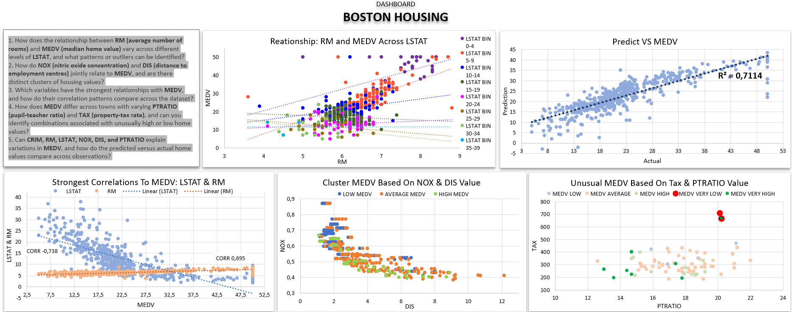
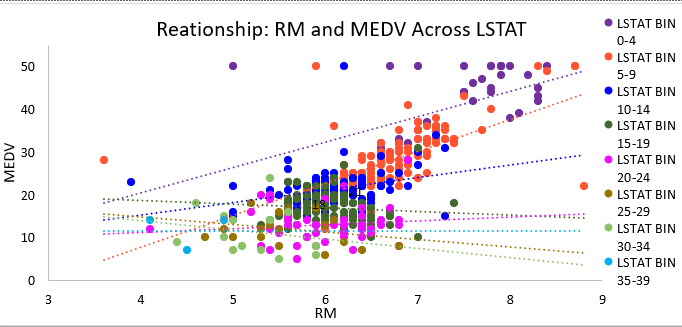
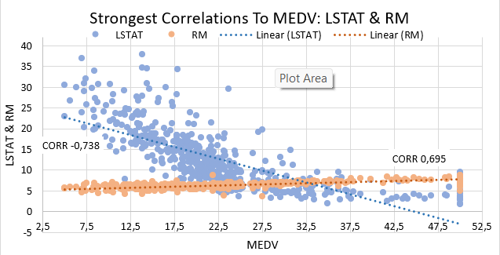
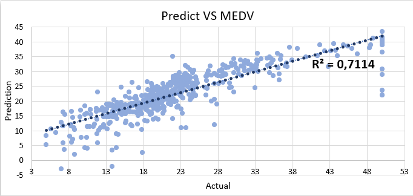
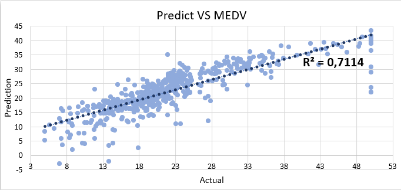
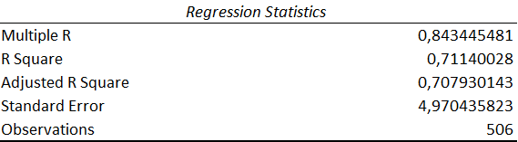
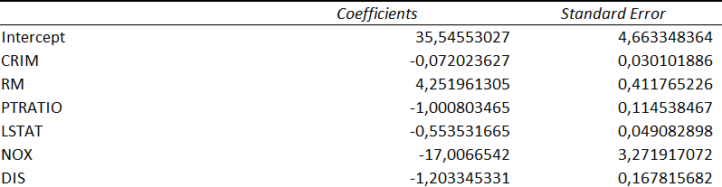

# Boston Housing

Dataset yang berisi informasi mengenai perumahan di area Boston, Massachusetts.

### Variabel:

- CRIM : Tingkat kejahatan per kapita
- ZN : Proporsi lahan yang diperuntukkan untuk perumahan dengan luas lahan lebih dari 25.000 kaki persegi
- INDUS : Proporsi luas lahan untuk bisnis non-perdagangan eceran di setiap kota
- CHAS : Apakah berbatasan dengan sungai Charles (= 1 jika wilayah berbatasan dengan sungai; = 0 jika tidak)
- NOX : Konsentrasi Nitric Oxide dalam satuan per 10 juta
- RM : Rata-rata jumlah kamar per rumah
- AGE : Proporsi rumah yang ditempati oleh pemilik dan dibangun sebelum tahun 1940
- DIS : Jarak menuju lima pusat pekerjaan di Boston
- RAD : Indeks tingkat aksesibilitas menuju jalan raya radial
- TAX : Tarif pajak properti berdasarkan nilai penuh per $10.000
- PTRATIO : Rasio jumlah murid terhadap guru berdasarkan kota
- B : Proposi penduduk kulit hitam (1000(Bk - 0.63)²)
- LSTAT : Persentase Populasi Miskin
- MEDV : Nilai median rumah yang ditempati oleh pemiliknya sendiri (dalam ribuan dolar)

### Pertanyaan

1. How does the relationship between RM (average number of rooms) and MEDV (median home value) vary across different levels of LSTAT, and what patterns or outliers can be identified?
2. How do NOX (nitric oxide concentration) and DIS (distance to employment centres) jointly relate to MEDV, and are there distinct clusters of housing values?
3. Which variables have the strongest relationships with MEDV, and how do their correlation patterns compare across the dataset?
4. How does MEDV differ across towns with varying PTRATIO (pupil-teacher ratio) and TAX (property-tax rate), and can you identify combinations associated with unusually high or low home values?
5. Can CRIM, RM, LSTAT, NOX, DIS, and PTRATIO explain variations in MEDV, and how do the predicted versus actual home values compare across observations?

## Dashboard

1. 
2. 
3. 
4. 
5. - 
   - 
   - 
