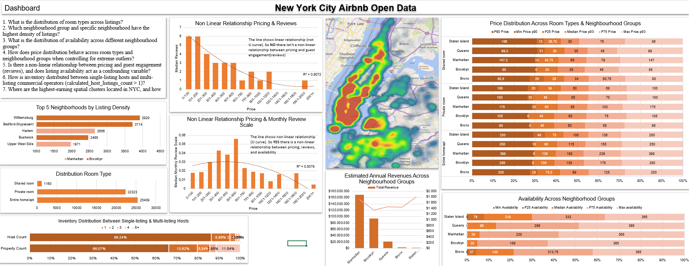
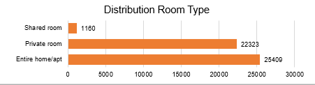
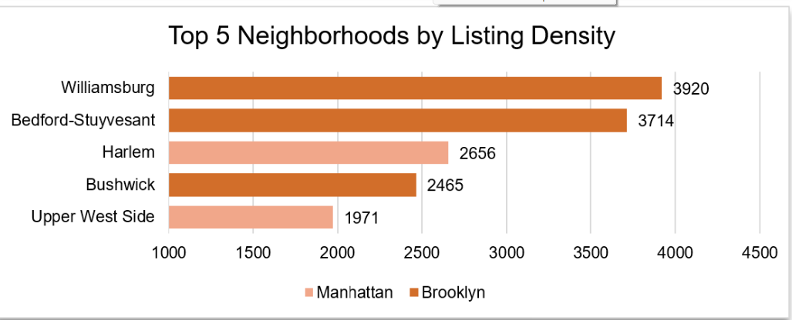
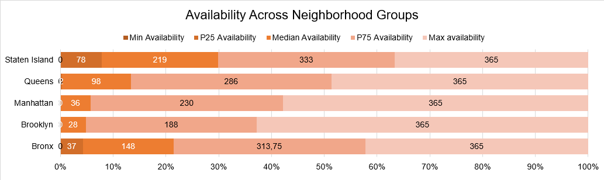
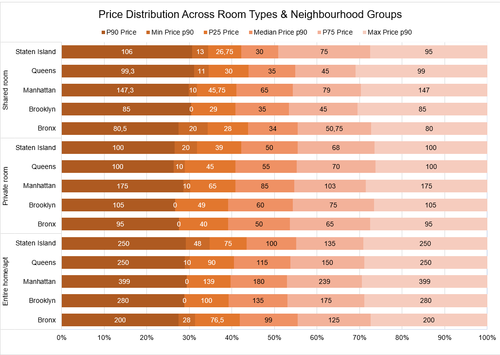
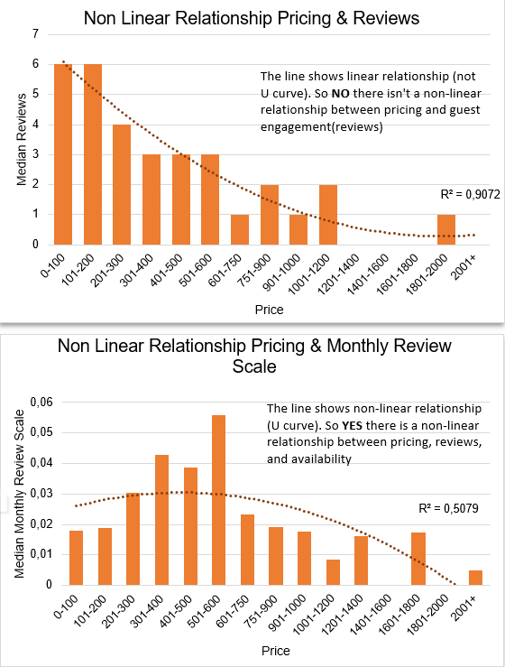
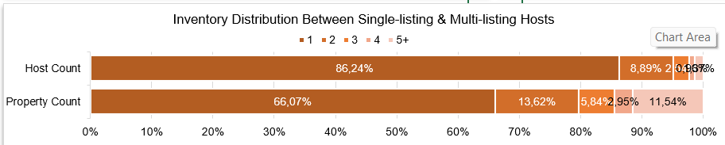
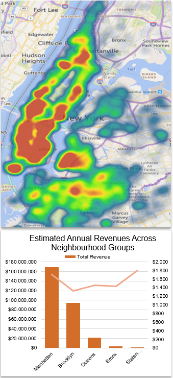

# New York City Airbnb Open Data

Dataset berisi informasi publik mengenai daftar Airbnb di kota New York pada tahun 2019. Dataset memiliki 50.000 daftar Airbnb.

### Variabel:

- id
- name
- host_id (ID Pemilik)
- host_name
- Daerah Airbnb
  - neighbourhood_group
  - neighbourhood
  - latitude
  - longitude
- room_type (Jenis kamar) : Private, Shared, apt, etc
- price
- minimum_nights (Jumlah tinggal malam min)
- number_of_reviews (Total Ulasan)
- last_review (Tanggal Terakhir Ulasan)
- reviews_per_month (Rata-rata ulasan per-bulan)
- calculated_host_listings_count (Jumlah penginapan dengan host yang sama)
- availability_365 (Jumlah hari tersedia dalam setahun)

### Pertanyaan

1. What is the distribution of room types across listings?
2. Which neighbourhood group and specific neighbourhood have the highest density of listings?
3. What is the distribution of availability across different neighbourhood groups?
4. How does price distribution behave across room types and neighbourhood groups when controlling for extreme outliers?
5. Is there a non-linear relationship between pricing and guest engagement (reviews), and does listing availability act as a confounding variable?
6. How is inventory distributed between single-listing hosts and multi-listing commercial operators (calculated_host_listings_count > 1)?
7. Where are the highest-earning spatial clusters located in NYC, and how do estimated annual revenues compare across neighbourhood groups?

## Dashboard

1. 
2. 
3. 
4. 
5. 
6. 
7. 
