# Online Shoppers Purchasing Intention

Dataset yang berisi kumpulan data mengenai pola pembelian dan perilaku konsumen saat berbelanja online.

### Variabel:

- Administrative : Jumlah halaman yang berhubungan dengan administratif dikunjungi
- Administrative_Duration : Total waktu berkunjung pada halaman administratif
- Informational : Jumlah halaman yang berhubungan dengan informasi dikunjungi
- Informational_Duration : Total waktu berkunjung pada halaman informasi
- ProductRelated : Jumlah halaman yang berhubungan dengan produk dikunjungi
- ProductRelated_Duration : Total waktu berkunjung pada halaman produk
- BounceRates : Persentasi pengunjung hanya melihat satu halaman website
- ExitRates : Persentasi pengunjung website keluar dari halaman tertentu
- PageValues : Rata-rata jumlah halaman yang dikunjungi sebelum pengunjung melakukan transaksi
- SpecialDay : Skala kedekatan tanggal kunjungan terhadap hari spesial
- Month : Bulan kunjungan
- Spesifikasi dari pengunjung:
  - OperatingSystems (Sistem Operasi Komputer)
  - Browser (Web Browser yang dipakai)
  - Region (Daerah pengunjung)
  - TrafficType : Sumber lalu lintas yang membawa pengujung ke website
- VisitorType (Jenis Pengujung) : Returning visitor atau New visitor
- Weekend (Apakah diakses saat akhir pekan) : True atau False
- Revenue (Apakah pengujung akhirnya membeli) : True atau False

### Pertanyaan

1. How does a visitor's closeness to key dates (special day) impact conversion rates (revenue =true) across different visitor cohorts (visitor type) over various months?
2. At what page-count threshold does the probability of conversion diminish for distinct user behavioral clusters derived from the joint distribution of different page types?
3. After accounting for right-skewed session lengths, what specific duration window optimizes time efficiency per page to maximize revenue?
4. When controlling for exit rates alongside page values, what is the independent predictive power of bounce rates on conversion given the interaction effect of different traffic sources?
5. Which specific combinations of operating systems, browsers, plus regional settings point to cross-platform technical friction causing anomalously low conversion rates despite high page values?

## Dashboard

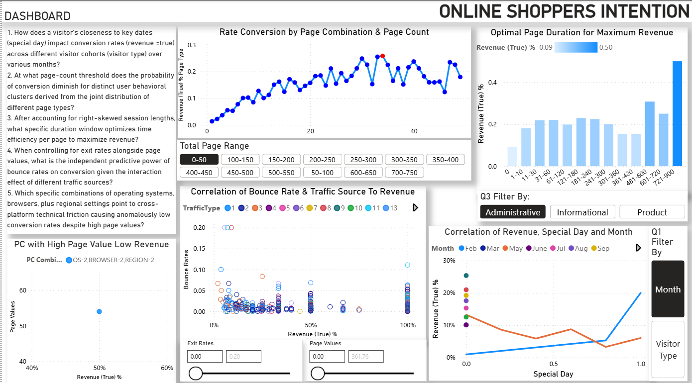

1.  - Terhadap Bulan: 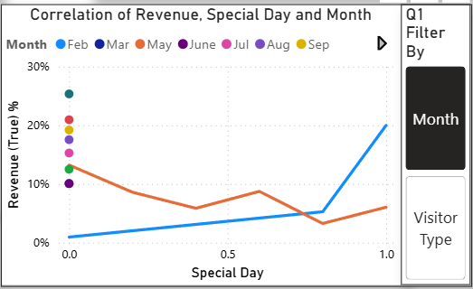
    - Terhadap Jenis Pengujung: 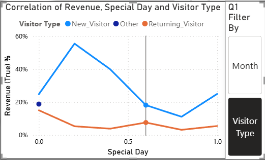
2.  - Halaman 0-49 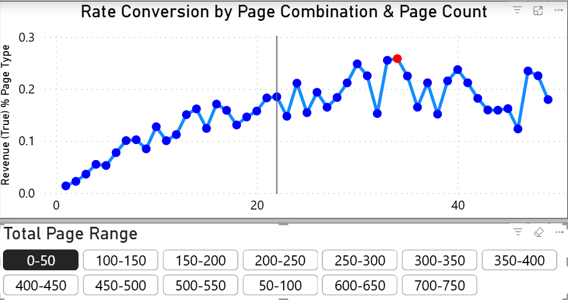
    - Halaman 50-99 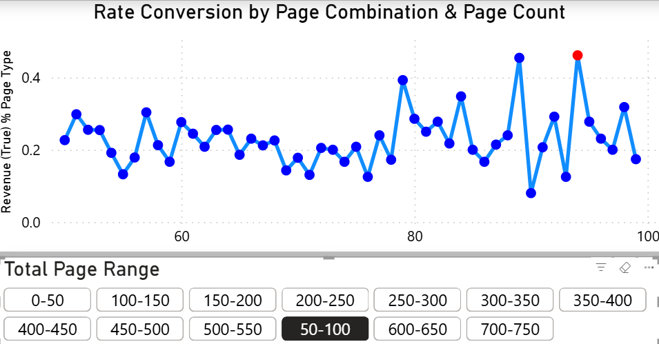
    - Halaman 100-149 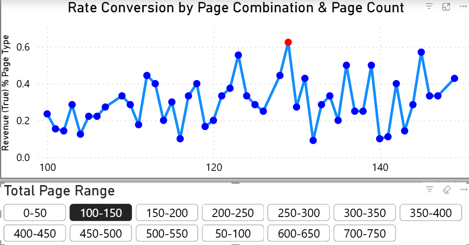
    - Halaman 150-199 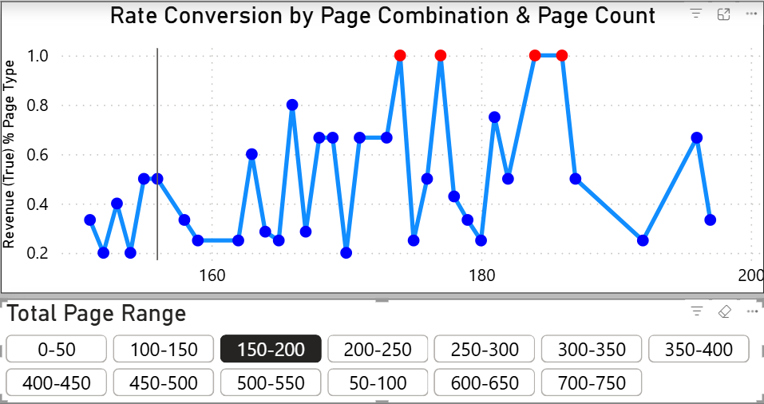
    - Halaman 200-249 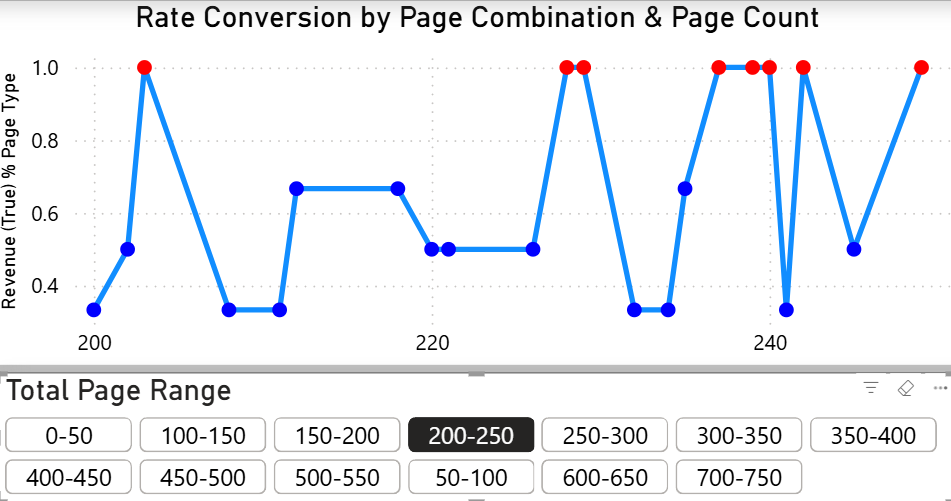
    - Halaman 250-299 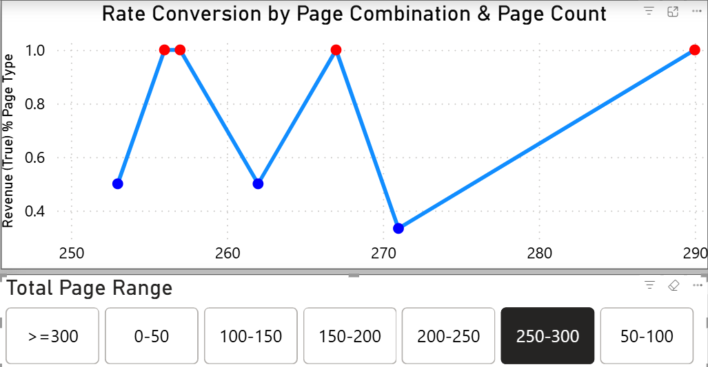
    - Halaman >=300 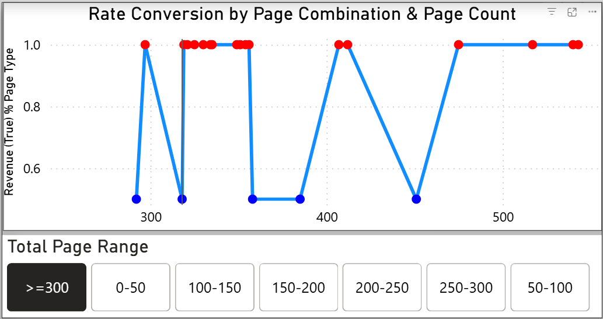
3.  - Halaman administratif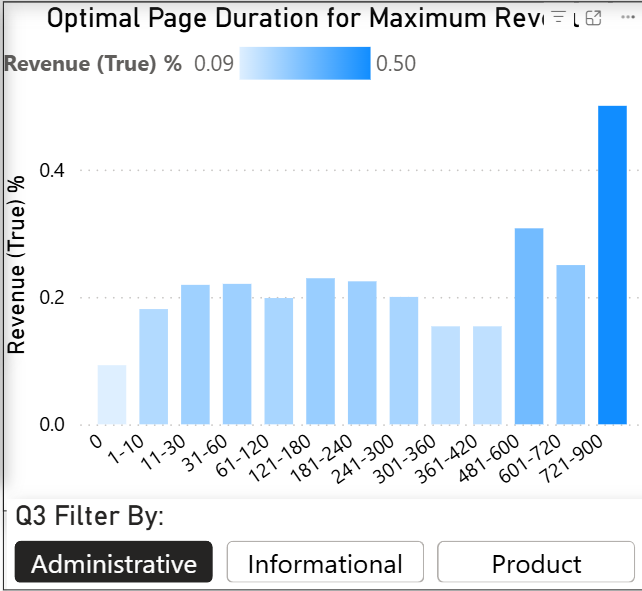
    - Halaman informasi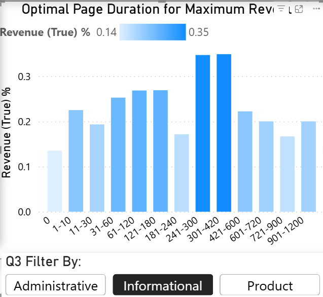
    - Halaman produk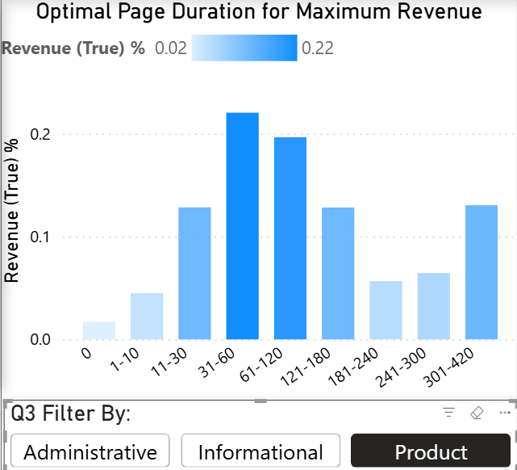
4.  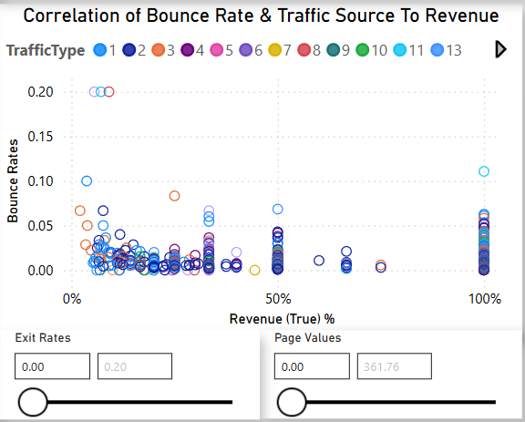
5.  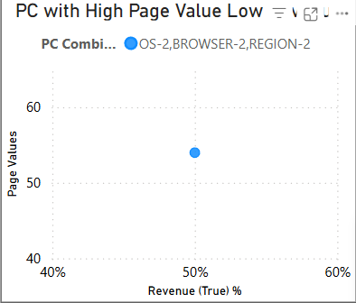
