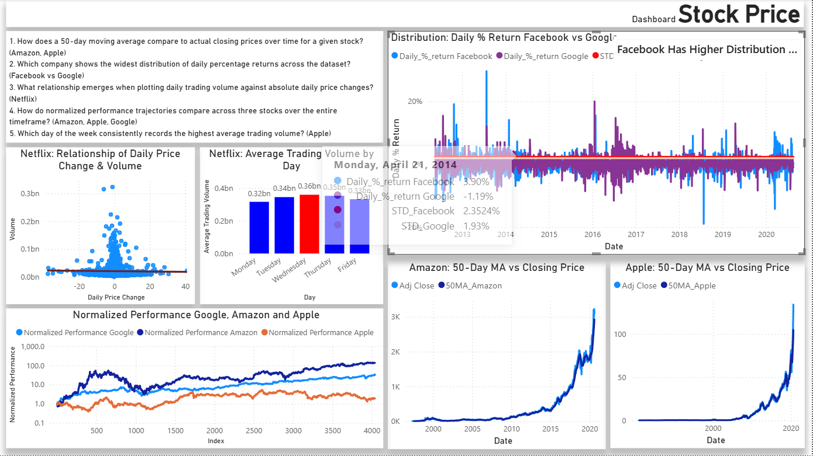
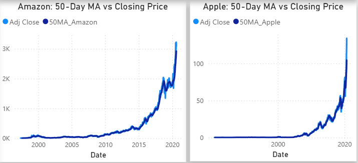
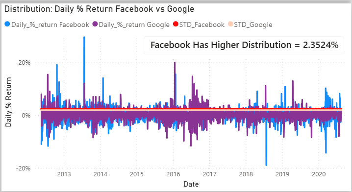
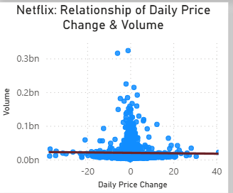
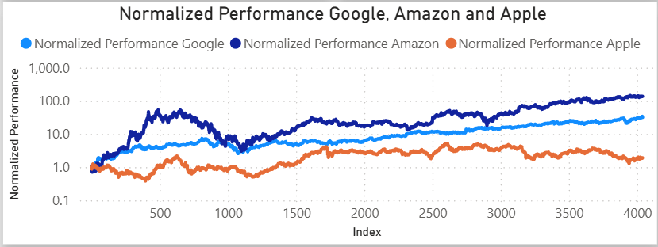
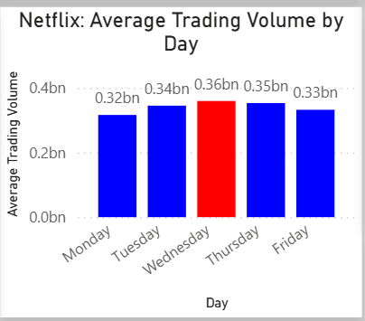

# Stock Price

Dataset berupa harga saham harian pada 4 perusahaan yaitu Amazon, Apple, Facebook, Google, dan Netflix.

### Variabel:

- Date (Tanggal harga saham di rekam)
- Open (Harga Pembukaan)
- High (Harga Tertinggi)
- Low (Harga Terendah)
- Close (Harga Penutupan)
- Adj Close (Harga Penutupan yang disesuaikan)
- Volume (Jumlah saham yang diperdagangkan)

### Pertanyaan

1. How does a 50-day moving average compare to actual closing prices over time for a given stock? (Amazon, Apple)
2. Which company shows the widest distribution of daily percentage returns across the dataset? (Facebook vs Google)
3. What relationship emerges when plotting daily trading volume against absolute daily price changes? (Netflix)
4. How do normalized performance trajectories compare across three stocks over the entire timeframe? (Amazon, Apple, Google)
5. Which day of the week consistently records the highest average trading volume? (Apple)

## Dashboard

1. 
2. 
3. 
4. 
5. 
